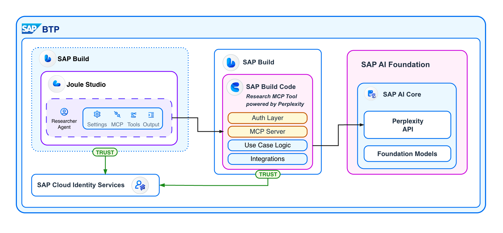

# Building and securing MCP servers in Python on BTP

MCP (Model Context Protocol) is the standard for tool access in AI agents. As SAP developers build extensions and integrations on SAP BTP, creating MCP servers has become equally relevant to expose business functionalities to AI agents. Whether you're extending Joule Studio or building custom AI solutions, MCP servers provide a standardized way to make your BTP services AI-accessible. In this tutorial, I'll show you how to build a production-ready MCP server on SAP Cloud Foundry using Python.



## What We'll Build

We'll create three progressively complex MCP servers:
1. **Simple Math Server** - Understanding the basics
2. **Research Server** - Integrating Perplexity AI via Generative AI Hub
3. **Secured Research Server** - Adding IAS authentication

All running on SAP Cloud Foundry, one of the most flexible and cost-effective runtime options on BTP.

## Prerequisites

Before starting, ensure you have:
- SAP BTP account with Cloud Foundry environment
- Cloud Foundry CLI installed and configured
- Python 3.9+ installed locally
- SAP Generative AI Hub access with service key (for Perplexity example)
- SAP Cloud Identity Services (IAS) tenant with admin access (for authentication example)

## Example 1: Simple MCP Server

Let's start with the basics. We'll use the `fastmcp` library which handles MCP's protocol specifications elegantly.

**File: `mcp_simple/server.py`**

```python
from starlette.responses import JSONResponse
from fastmcp import FastMCP
import os

# Initialize FastMCP server
mcp = FastMCP("Simple Math Server")


@mcp.tool()
def add(a: float, b: float) -> float:
    """
    Add two numbers together.

    Args:
        a: First number
        b: Second number

    Returns:
        Sum of a and b
    """
    return a + b


if __name__ == "__main__":
    mcp.run(transport="http", host="0.0.0.0", port=int(os.environ.get("PORT", 8080)))
```

**Key BTP Adaptations:**
- **PORT environment variable**: Cloud Foundry assigns a dynamic port via the `PORT` environment variable — we must use it
- **HTTP transport**: We use HTTP transport (not stdio) to make the MCP server accessible via network

**File: `mcp_simple/manifest.yml`**

```yaml
---
applications:
- name: simple-mcp-server
  memory: 1024M
  disk_quota: 1024M
  buildpack: python_buildpack
  command: python server.py
```

**Deploy to Cloud Foundry:**

```bash
cd mcp_simple
cf push
```

That's it! You now have a working MCP server on BTP.

## Example 2: Research Server with Perplexity AI

Now let's build something more practical: a research tool powered by Perplexity AI through SAP Generative AI Hub.

### Why wrap Perplexity instead of using it directly?

You might wonder why not use Perplexity's native MCP server. Two reasons:
1. **Educational value** - Great exercise to understand the full stack
2. **Generative AI Hub integration** - The Hub exposes the API but not API keys. Perplexity's native MCP requires direct API keys, which isn't compatible with the Hub's proxy model where credentials stay on the server side.

### Perplexity Client Implementation

**File: `mcp_perplexity/perplexity.py`**

This client handles:
- Loading AI Core credentials from `ai_core_key.json`
- OAuth token management with automatic refresh
- Calling Perplexity's sonar model via Generative AI Hub
- Formatting results with citations and related questions

Here's the core implementation snippet showing the Gen AI Hub integration:

```python
class PerplexityClient:
    """Client for Perplexity API via SAP Gen AI Hub native proxy."""

    def __init__(self, config_file: str = 'ai_core_key.json'):
        """Initialize the client with AI Core credentials."""
        self.config = self._load_config(config_file)
        self.token = None
        self.token_expiry = 0
        self._refresh_token()

        # IMPORTANT: Create a Gen AI Hub deployment for Perplexity's sonar-pro model
        # Replace this with your own deployment ID from AI Core
        # Best practice: Load from environment variable
        import os
        self.deployment_id = os.environ.get("AI_CORE_DEPLOYMENT_ID", "your-deployment-id")

        # Build API URL: Gen AI Hub base URL + deployment endpoint
        self.base_url = self.config['serviceurls']['AI_API_URL']
        self.api_url = f"{self.base_url}/v2/inference/deployments/{self.deployment_id}/chat/completions"

    def research(self, query: str) -> str:
        """Research a query using Perplexity AI with real-time web search."""
        self._ensure_valid_token()

        payload = {
            "model": "sonar-pro",
            "messages": [{"role": "user", "content": query}],
            "max_tokens": 5000,
            "temperature": 0.3,
            "return_citations": True
        }

        headers = {
            "Authorization": f"Bearer {self.token}",
            "Content-Type": "application/json",
            "AI-Resource-Group": "default"
        }

        response = requests.post(self.api_url, json=payload, headers=headers)
        # ... format results with citations ...
```

The key is the URL structure: `{AI_API_URL}/v2/inference/deployments/{deployment_id}/chat/completions` — this routes through Gen AI Hub to Perplexity's native API while preserving citation metadata.

**AI Core Configuration File Structure:**

Create `ai_core_key.json` with your Generative AI Hub service key:

```json
{
  "clientid": "your-client-id",
  "clientsecret": "your-client-secret",
  "url": "https://your-tenant.authentication.sap.hana.ondemand.com",
  "serviceurls": {
    "AI_API_URL": "https://api.ai.prod.eu-central-1.aws.ml.hana.ondemand.com"
  }
}
```

**Note**: You'll need to create a deployment in AI Core for the Perplexity model and update the `deployment_id` in the code with your own.

### MCP Server with Research Tool

**File: `mcp_perplexity/server.py`**

```python
from starlette.responses import JSONResponse
from fastmcp import FastMCP
import os
from perplexity import PerplexityClient

# Initialize FastMCP server
mcp = FastMCP("Research Server")

# Initialize Perplexity client
client = PerplexityClient()


@mcp.tool()
def research(query: str) -> str:
    """
    Research tool using Perplexity AI with real-time web search and citations.

    Args:
        query: The research query (simple string input)

    Returns:
        Research results with answer and source citations
    """
    return client.research(query)


if __name__ == "__main__":
    mcp.run(transport="http", host="0.0.0.0", port=int(os.environ.get("PORT", 8080)))
```

Simple and clean — the MCP decorator handles all protocol complexity, and we just delegate the query to our Perplexity client.

**Important**: We're using Generative AI Hub's native Perplexity proxy (not the orchestration module) because it preserves citation metadata that's crucial for research tasks.

## Example 3: Adding IAS Authentication

For production use, we need to secure the MCP server. Let's add authentication using SAP Cloud Identity Services (IAS).

### IAS Setup Prerequisites

Before implementing authentication, complete these IAS configuration steps:
1. Create an IAS application in your IAS tenant
2. Configure OAuth 2.0 client credentials
3. Add custom attribute `ias_apis` with value `api_read_access`
4. Note your token URL, client ID, client secret, and audience

*For detailed IAS setup instructions, refer to my previous blog post on Python authentication with IAS.*

### Secured MCP Server Implementation

**File: `mcp_ias_auth/server.py`**

The secured version adds an authentication middleware that:
- Validates JWT tokens from IAS
- Verifies token signature using JWKS (JSON Web Key Set)
- Checks audience and issuer claims
- Ensures required scope (`api_read_access`) is present

```python
from fastmcp import FastMCP
from fastapi import FastAPI, Request
import os
import requests
import jwt
import uvicorn
from perplexity import PerplexityClient
from fastapi.responses import JSONResponse
from starlette.middleware.base import BaseHTTPMiddleware

# Initialize Perplexity client
client = PerplexityClient()

# Create MCP server
mcp = FastMCP("Research Server")

# IAS Configuration - Replace with your values
ISSUER = os.environ.get("IAS_ISSUER", "https://your-tenant.accounts.ondemand.com")
JWKS_URL = f"{ISSUER}/oauth2/certs"
AUDIENCE = os.environ.get("IAS_AUDIENCE", "your-client-id-here")


class IASAuthMiddleware(BaseHTTPMiddleware):
    """Middleware to validate IAS JWT tokens."""

    def get_public_key(self, token: str):
        """Fetch JWKS and find matching public key for token validation."""
        kid = jwt.get_unverified_header(token)["kid"]
        jwks = requests.get(JWKS_URL).json()

        for key in jwks["keys"]:
            if key["kid"] == kid:
                return jwt.algorithms.RSAAlgorithm.from_jwk(key)

        raise Exception("No matching key found in JWKS")

    def verify_token(self, token: str):
        """Validate JWT token signature and claims."""
        public_key = self.get_public_key(token)
        payload = jwt.decode(
            token,
            public_key,
            algorithms=["RS256"],
            audience=AUDIENCE,
            issuer=ISSUER
        )

        # Verify required scope
        if "api_read_access" not in payload.get("ias_apis", []):
            raise Exception("Missing required ias_apis scope")

        return payload

    async def dispatch(self, request: Request, call_next):
        # Extract and validate authorization header
        auth_header = request.headers.get("Authorization")

        if not auth_header or not auth_header.startswith("Bearer "):
            return JSONResponse(
                status_code=401,
                content={"detail": "Missing or invalid authorization header"}
            )

        token = auth_header.split(" ")[1]

        try:
            payload = self.verify_token(token)
            request.state.user = payload
        except Exception as e:
            return JSONResponse(
                status_code=401,
                content={"detail": f"Authentication failed: {str(e)}"}
            )

        return await call_next(request)


@mcp.tool()
def research(query: str) -> str:
    """
    Research tool using Perplexity AI with real-time web search and citations.

    Args:
        query: The research query

    Returns:
        Research results with answer and source citations
    """
    return client.research(query)


# Create ASGI app from MCP server
mcp_app = mcp.http_app(path='/mcp')

# Create FastAPI wrapper with lifespan management
app = FastAPI(title="Researcher MCP", lifespan=mcp_app.lifespan)

# Add IAS authentication middleware
mcp_app.add_middleware(IASAuthMiddleware)

# Mount the MCP server
app.mount("/", mcp_app)


if __name__ == "__main__":
    uvicorn.run(app, host="0.0.0.0", port=int(os.environ.get("PORT", 8080)))
```

**What changed for authentication:**

The key difference from the unsecured version is the middleware layer. Since `fastmcp` is built on Starlette/FastAPI, we can leverage standard ASGI middleware patterns. The `IASAuthMiddleware` intercepts every request, validates the JWT token against IAS's public keys (JWKS), and checks required claims before allowing access to MCP endpoints.

To integrate the middleware, we extract the ASGI app from `fastmcp` using `http_app()`, wrap it with FastAPI to manage lifespan properly, add our authentication middleware, and mount it. This pattern works seamlessly with Cloud Foundry's router.

### Testing Authentication

Test your secured endpoint:

**1. Without token (should fail):**
```bash
curl "https://research-mcp-server-ias-auth.cfapps.sap.hana.ondemand.com/mcp"
```
Response: `401 - {"detail":"Missing or invalid authorization header"}`

**2. With valid token (should succeed):**
```bash
curl "https://research-mcp-server-ias-auth.cfapps.sap.hana.ondemand.com/mcp" \
  -H "Authorization: Bearer eyJqa3U..."
```
Response: `200 OK` with `mcp-session-id` header

Perfect! Our MCP server now requires valid IAS authentication.

## Using the MCP Server in Joule Studio

Now that we have a secured MCP server, let's integrate it with Joule Studio to build an AI agent with research capabilities.

### Step 1: Create a Destination

Navigate to your BTP Subaccount (where Joule Studio is running):
1. Go to **Connectivity → Destinations**
2. Create a new destination with these settings:
   - **Name**: `research-mcp-server`
   - **Type**: `HTTP`
   - **URL**: `https://research-mcp-server-ias-auth.cfapps.sap.hana.ondemand.com`
   - **Authentication**: `OAuth2ClientCredentials`
   - **Client ID**: Your IAS client ID
   - **Client Secret**: Your IAS client secret
   - **Token Service URL**: `https://your-tenant.accounts.ondemand.com/oauth2/token`

**Important**: Don't include `/mcp` in the URL — Joule Studio appends this automatically.


### Step 2: Create Agent in Joule Studio

1. Create a new Agent in your Joule Extension Project
2. Define the agent's expertise and instructions
3. In the **MCP** section, click **Add MCP Server**
4. Select your `research-mcp-server` destination
5. Verify the `/mcp` path (default is fine)
6. You'll see the available tools (in our case: `research`)


### Step 3: Test Your Agent

Start a conversation with your agent and ask it to research current information:

> "Research the current situation in the Middle East"

The agent now has access to real-time web information via your MCP server!


This opens powerful possibilities: combine up-to-date web data with transactional business data from S/4HANA, SuccessFactors, or other SAP systems.

## Using It in Action

Now let's test it in action - I started the agent and asked it to research the current situation in the Middle East and it works! Up-to-date information directly in Joule - can now be combined with any business transactional data one might pull from an S/4HANA system.

By the way, check out my blog on connecting Joule Studio to on-premises HTTP APIs to extend this pattern further.

In the GitHub repository I've added all the different examples including the simple example, with auth based on IAS as well as based on XSUAA, and the Perplexity code. Hope you found this interesting. Leave a comment in case of any questions!
